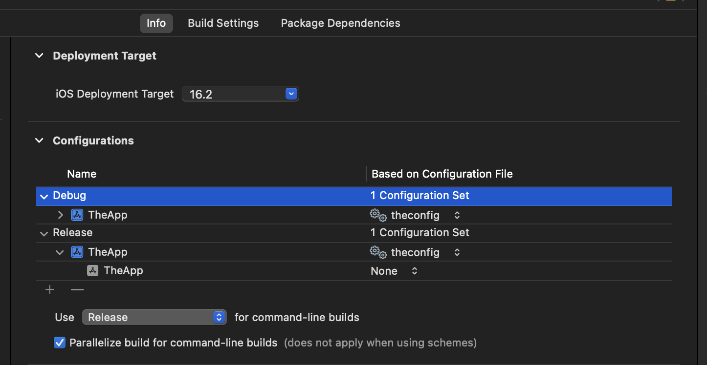

# Set Up

## Android

**Step 1:** Create a `github.properties` file at the root of the project, with the following contents:

```groovy
gpr.user=${GITHUB_USERNAME}
gpr.key={GITHUB_ACCESS_TOKEN}
```

**Step 2:** Add the GitHub maven repository to the line 1 of the `settings.gradle.kts`. To do this, copy and paste the code below in line 1 of the `settings.gradle.kts` file.

```groovy

pluginManagement {
    repositories {
        google()
        mavenCentral()
        gradlePluginPortal()
    }
}

def githubProperties = new Properties()
githubProperties.load(new FileInputStream(file("github.properties")))

dependencyResolutionManagement {
    repositoriesMode.set(RepositoriesMode.FAIL_ON_PROJECT_REPOS)
    repositories {
        google()
        mavenCentral()
        maven {
          name = "GithubPackages"
          url = uri("https://maven.pkg.github.com/mobileappconsultant/newsfeedkmmsdk")
          credentials {
            username = githubProperties["gpr.user"] as String? ?: System.getenv("GPR_USER")
            password = githubProperties["gpr.key"] as String? ?: System.getenv("GPR_KEY")
          }
        }
    }
}
```
**Step 6:** In the app-level `build.gradle`, add the following dependency:
```groovy
implementation ("com.mobileappconsultant.newsfeedkmmsdk:sdk:0.0.1-ALPHA-SNAPSHOT")
```
**Step 7:** Sync the project and build.

## iOS

**Step 1:** Inside the XCode project, create a new configuration settings file:

* Give the file a name, and do not add the file to any target.
* Once the file has been created, open it and paste the following content:

```
OTHER_LDFLAGS = $(inherited) -framework sdk
REPO_NAME = newsfeedkmmsdk
ACCESS_TOKEN = {YOUR_ACCESS_TOKEN}
REPOSITORY = https:/$()/$(ACCESS_TOKEN)@github.com/mobileappconsultant/newsfeedkmmsdk
BRANCH = 0.0.1-ALPHA-SNAPSHOT
MY_FRAMEWORK_PATH[sdk=iphonesimulator*] = $(BUILD_DIR)/$(REPO_NAME)/sdk.xcframework/ios-arm64_x86_64-simulator
MY_FRAMEWORK_PATH[sdk=iphoneos*] = $(BUILD_DIR)/$(REPO_NAME)/sdk.xcframework/ios-arm64
FRAMEWORK_SEARCH_PATHS = $(inherited) $(MY_FRAMEWORK_PATH)
```

* Generate an access token on GitHub, and replace `{YOUR_ACCESS_TOKEN}` with the access token generated.
* Change the value of `BRANCH` to whatever branch/release version is to be used.
* Select the XCode Project, and add the configuration settings to the targets:
  
* Finally, create a new *Run Script Build Phase* and paste the following content:

```shell
pushd $BUILD_DIR

if [ -d "$BUILD_DIR/$REPO_NAME" ]; then

    git config pull.rebase true

    echo "Repository already cloned! Checking for updates..."
    pushd "$BUILD_DIR/$REPO_NAME"
    git pull origin $BRANCH -f
    
    CURRENT_BRANCH=$(git rev-parse --abbrev-ref HEAD)
    
    if [ $CURRENT_BRANCH != $BRANCH ]; then
        git checkout $BRANCH || exit
    fi
    
    #Ls the contents
    echo "Listing the contents..."
    ls
    
    rm -rf sdk.xcframework
    unzip sdk.xcframework.zip -d . || exit
    
    popd
else
    echo "Cloning $REPOSITORY..."
    git clone $REPOSITORY $REPO_NAME || exit
    
    pushd "$BUILD_DIR/$REPO_NAME"
    
    git config pull.rebase true
    
    # Checkout the artifacts branch
    git checkout $BRANCH
    
    #Ls the contents
    echo "Listing the contents..."
    ls
    
    rm -rf sdk.xcframework
    
    # Unzip the zip file
    unzip sdk.xcframework.zip -d . || exit
    
    popd
fi

popd


cp -r $MY_FRAMEWORK_PATH/sdk.framework ${TARGET_BUILD_DIR}/${FRAMEWORKS_FOLDER_PATH}
```

* Build the project

# Usage

## Android


```kotlin
val response: ApiResponse<LoginMutation.Response> = NewsFeedSDK.login(input)
if (!response.error) {
    val data = response.data
    // Do something with data
}
```

## iOS

```swift
import magicsdk
// ...

Task {
    let response = NewsFeedSDK.companion().login(input)
    if !response.error {
        let data = response.data
        // Do something with data
    } 
}

// ...
```

# Publishing a new version

Update the version in the *VERSION* file and run the following command to deploy a new version:
```shell
./deploy.sh
```